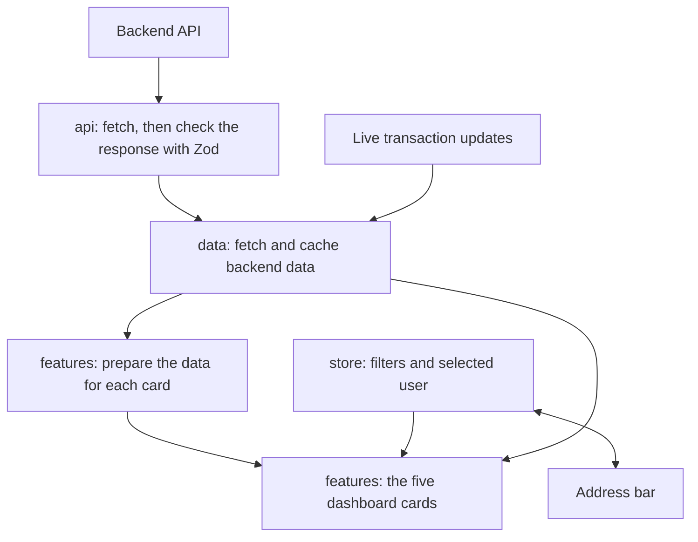

# Reliability Index Explorer

A tool for risk analysts to view and understand a user's Reliability Index, a
credit score from 0 to 100 that the backend builds from a person's bank
transaction history. The score is meant for people who have little or no
ordinary credit history, so the transaction data is the main evidence.

The tool exists so an analyst can see how a score was reached, look at the
transactions behind it, spot anything unusual, and check that the scoring
behaves the way it should.

## What the app does

Pick a user from the sidebar and the dashboard shows five things about them.

1. **Reliability Overview.** The headline score on a gauge, the score band
   (low, medium or high), the date range the score covers, six key numbers,
   and the top reasons behind the score.
2. **Score Breakdown.** The four parts that add up to the score, each one
   shown with its value and where it falls on its own scale.
3. **Monthly Cashflow.** A chart of money in, money out, and the net result
   for every month the score covers.
4. **Score Explanation.** The reasons behind the score, sorted into what is
   helping and what is hurting, each written in plain words.
5. **Transaction Explorer.** The full list of transactions used in scoring,
   with search, filters for category and for money in or out, sorting, and
   smooth scrolling even with thousands of rows.

The app also listens for live transaction updates and adds them into the
list and the chart as they arrive.

## Getting started

You need Node version 20 or newer and Yarn (the classic version 1).

```bash
yarn install
yarn dev
```

Open the address Vite prints, usually `http://localhost:5173`.

By default the app talks to the hosted backend. To point it somewhere else,
copy `.env.example` to `.env` and set `VITE_API_BASE_URL`.

Other commands:

```bash
yarn test          # run the test suite once
yarn lint          # check code style
yarn typecheck     # check the types
yarn run check     # run all three of the above together
yarn build         # build the app ready to deploy
```

A note on `yarn run check`: Yarn version 1 has its own built in `yarn check`
command, so the project script has to be called with `yarn run check`.

## Libraries chosen, and why

The brief asks for the library choices to be documented.

| Library | What it does here | Why |
| --- | --- | --- |
| React with TypeScript | The app itself | The combination the brief asks for. TypeScript catches mistakes before the code runs. |
| Vite | Runs the app while developing, and builds the final version | Starts and rebuilds fast. |
| TanStack Query (React Query) | Fetches backend data, caches it, tracks loading and error states | Removes a large amount of fetching and caching code that would otherwise be written by hand. |
| Zustand | Holds the small pieces of information the analyst controls, such as the active filters | Light and simple, and several components can read the same information without passing it down by hand. |
| Zod | Checks that every backend response has the fields the app expects, at the moment it arrives | If the backend sends something unexpected, the app says so at that exact spot with a clear message, instead of failing in a confusing way later. |
| React Router | Maps web addresses to screens, and keeps the filters in the address bar | A filtered view can be shared by copying the link. |
| Recharts | Draws the monthly cashflow chart | A solid chart library, quick to set up. |
| TanStack Virtual | Lets the transaction list hold thousands of rows | Only the rows on screen are actually drawn, so scrolling stays smooth. |
| MSW (Mock Service Worker) | Stands in for the backend during tests | Tests stay fast and predictable, and do not depend on the network. |
| Vitest with Testing Library | Runs the tests | Fast, and made for a Vite project. |
| Tailwind CSS | Styling | Its small styling classes keep the look consistent. |
| lucide-react | Icons | A clean, light icon set. |

## How the code is organised

Each folder under `src` has one job.

| Folder | What lives there |
| --- | --- |
| `src/api` | Everything that talks to the backend: the fetch functions, the Zod checks that describe each response, and the two kinds of error the app reports. |
| `src/domain` | Small helper functions with no link to React or the network: money formatting, date maths, the scoring helpers, the merchant category names. |
| `src/data` | The link between the backend and the screens: the parts that fetch and cache backend data, and the shared transaction data that live updates are combined into. |
| `src/store` | The Zustand stores for the filters and the selected user, plus the piece that keeps those in step with the address bar. |
| `src/features` | One folder per dashboard feature: overview, breakdown, cashflow, explanation, transactions. Each folder also holds the logic only that feature needs: the cashflow card's monthly totals, the explorer's filtering and sorting. |
| `src/routes` | The page frame: the sidebar, the top bar, the user picker, and the dashboard that arranges the feature cards. |
| `src/ui` | Small building blocks reused across features: the card, the loading placeholder, the empty state, the error state, and the error catcher. |
| `src/config.ts` | Every number worth adjusting in one place: page sizes, retry counts, the scoring window length, and the scores where each band starts. |
| `src/theme.ts` | Every colour in one place. Both the styling system and the chart read from it. |
| `src/test-utils` | The fake data builders and the mock backend used by the tests. |

One rule keeps the feature folders from tangling: a feature folder never
imports from another feature folder. So a feature folder holds only the code
that one feature uses, and anything two or more features need lives in a
shared folder instead: `data`, `domain`, `store` or `ui`.

This is why the cashflow totals and the transaction filtering each sit with
the one feature that uses them, while the code that talks to the backend
stays in `src/data`. That backend code is kept together even when only one
screen uses a given piece today, because its job is looking after backend
data, not drawing one screen. The live updates connection is the clearest
example: only the transaction explorer switches it on, but it keeps the
shared transaction data fresh for the cashflow chart as well, so it belongs
with the data rather than inside one feature.

## How data flows through the app



The journey of a score, step by step:

1. The analyst picks a user. The user id goes into the address bar as part of
   the path, and into the store that holds the selected user.
2. The app asks the backend for that user's score. The response passes through
   the Zod check, which confirms it has the expected fields, then React Query
   caches it.
3. The app asks the backend for the transaction history. The backend returns
   the data one page at a time, so the app asks for each page in turn until
   there are no more, and reports progress as it goes.
4. The transactions are stored in a lookup table that finds each one by its
   id, which makes later updates quick and removes any duplicates.
5. The filter store holds what the analyst has narrowed down to. The explorer
   filters and sorts the stored transactions and shows the result.
6. The cashflow card sums the same transactions into monthly totals.
7. If a live update arrives, it is applied straight to the cached data, and
   every card reading that cache redraws on its own.

## State management decisions

State is split into three kinds, each kept where it belongs.

**Backend data** (the score, the transactions) lives in React Query. React
Query owns fetching, caching, retrying, and the loading and error states. A
component never keeps its own copy of backend data.

**State the analyst controls** (the filters, the chosen user) lives in
Zustand. It is small, it is not backend data, and several components read it,
so a shared store fits better than passing it down by hand from one component
to the next.

**The address bar** is treated as the shareable record of the filters. When a
filter changes, the address bar is updated a short moment later, so a burst of
typing in the search box counts as one change rather than one per keystroke.
Opening a saved link restores the same filtered view.

## Component design

The five features are each a self contained folder. Each one is wrapped in an
error catcher tied to the selected user, so if one feature hits an unexpected
error the other four keep working, and picking a different user clears it.

Repeated layout pieces are pulled into `src/ui` as small building blocks: a
card, a loading placeholder, an empty state, an error state, and the error
catcher. A feature builds itself out of these rather than restating the same
layout.

Every feature handles three states on its own: it shows a loading placeholder
while the data is on its way, an error state with a retry button if the
request fails, and an empty state if there is genuinely nothing to show.

## Testing

There are 186 tests. They run with `yarn test`.

For the helper functions (the API client, the date and money and scoring
helpers, the functions that prepare the data, the code that updates the
stores) the test was written before the function, watched fail, and then made
to pass. These are the parts where a quiet mistake would be hardest to notice
later, so they have close coverage.

For the React components the bar is lighter: each one has a test that draws
it and checks the important text and behaviour appear. The mock backend (MSW)
answers the network calls during tests, so the tests are fast and do not
depend on the real backend being up.

## Assumptions

* The scoring window is six months and ends on the chosen date. This is
  confirmed in the backend's API specification.
* The discovery address lists users under the name `available_users`. The
  app also accepts two other common names in case the backend changes, and
  falls back to a single sample user if it recognises none of them.
* The income coverage ratio can come back empty when a user has no essential
  expenses, because there is nothing to divide by. The app shows a dash in
  that case rather than treating it as an error.
* Each user's transactions are all in one currency.

## Tradeoffs and limitations

* **Live updates could not be checked against the real backend.** The feature
  is built and covered by tests, but while it was being built the hosted
  backend's live updates address was returning an error, so it was only
  verified against the mock backend and the tests.
* **All transaction pages are loaded in advance.** This keeps filtering,
  sorting and the chart simple, because every calculation runs over the full
  set the app already holds. For very large histories this would change to
  asking the backend to do the filtering and return pages as needed. See the
  Scalability note below.
* **Merchant category names cover only the codes seen in the data.** An
  unrecognised code shows the raw number rather than a guessed name, on
  purpose, so the tool never invents a label.
* **The transaction list was tested with 2000 rows of sample data.** The
  list only ever draws the rows on screen, so it is built to go well past
  that, but it has not been tried at 100,000 rows.

## AI usage disclosure

This project was built with heavy use of an AI coding assistant (Claude),
which the brief explicitly permits.

The AI was used throughout: planning the structure, writing the components,
the helper functions and the tests, fixing problems found while testing
against the real backend, and drafting this README.

The work was directed step by step. The decisions about which libraries to
use, how to structure the code, what to build and in what order, and where to
correct course were made by the developer and given to the AI as direction.
The developer reviewed the changes, ran the type checks, the linter and the
tests after each step, and pushed back when the output missed the mark.

Two examples of that direction shaping the result: the AI's first comments
were rewritten several times because they used jargon a reader would have to
look up, and several problems (the way pages of data are requested, a field
that could be empty, the score gauge colour bands) were found by testing
against the live backend and the API specification rather than trusting the
first build.

## Discussion topics

These are the topics the brief lists for the interview. They are not built
into the app; the notes below are how the current design would approach them.

### API design and evolution

Every backend response is checked against a Zod description the moment it
arrives. If the backend changes a field, the app reports it at that exact
spot with a clear message, instead of failing somewhere deep in the screen.
This already paid off twice while building: the transactions address split
its data into pages differently than first assumed, and one number could come
back empty. Both were caught by the response check and fixed in one place.

For new reasons behind a score: the list of reasons is plain text from the
backend, and the app shows whatever arrives, so a brand new reason needs no
frontend change. A new number would need a new tile on the overview, which is
a small, contained addition.

### Data ownership and boundaries

The score, the band, the key numbers and the plain language reasons are all
worked out by the backend. The frontend never recomputes the score. The
frontend owns presentation, plus the filtering, sorting and searching of the
transaction list, and the monthly cashflow totals, which are simply sums of
transactions already fetched.

Keeping the score on the backend means it is worked out in just one place, so
the scoring rule cannot fall out of step between the two sides. The cashflow
totals are kept on the frontend only because they are simple sums of data the
app already holds; if the rule for them grew complex they would move to the
backend too.

### Data consistency and correctness

Transactions can arrive in any order. The app sorts them when displaying, so
the order they arrive in does not matter. They are stored in a lookup table
that finds each one by its id, so the same transaction arriving twice replaces
the old copy rather than showing twice.

Live updates use the same lookup table: add, change or remove by id. Applying
the same update twice produces the same result as applying it once, so if the
connection drops and the backend replays updates when it reconnects, nothing
is double counted or scrambled.

While transactions are still loading, the app reports how many of the total
have arrived, so it is clear the data is still coming in rather than looking
finished.

### Scalability

The transaction list only ever draws the rows on screen, so the cost of
showing it does not grow with the number of rows.

The weak point at very large counts is that all pages are loaded in advance
and filtered inside the app. At 100,000 transactions and beyond, the
filtering, sorting and searching would move to the backend, which would return
one page of already filtered results at a time, and the cashflow totals would
be worked out by the backend rather than summed on the frontend. The frontend
structure would not change much, because fetching is already kept separate
from display.

For very frequent updates, the live updates would be collected and applied in
small batches a few times a second, rather than redrawing once per update.

### Real time updates

Live updates are applied to one shared copy of the transaction data, and
every view reads from that one copy, so the chart and the table can never
disagree with each other.

Keeping the screen calm when updates arrive fast is a matter of batching, as
noted above. Because each update is safe to apply more than once, a
reconnection that replays missed updates is safe. A visible indicator shows
whether the live connection is currently open, connecting, or down, so the
analyst knows whether they are looking at fresh data.

### Caching and performance

React Query caches each backend response, labelled with the user and the date
range. Returning to a view shows the cached copy at once while a fresh copy
loads quietly in the background. Cached copies are considered fresh for a set
time and are dropped after a longer idle time.

When a live update arrives, the cached copy is updated directly, so the screen
updates without a new request to the backend. If a stronger guarantee of
freshness were needed, the relevant cached copy would be marked as out of date
so React Query fetches it again.

### Incident thinking

If the screen looked slow or wrong once the app is live, the first move is to
narrow down which part is at fault, and the clear split between fetching the
data, preparing it, and drawing it makes that quick.

If the data looks wrong, the response check is the first place to look,
because a change in the layout of the backend's response would already have
been reported there. If the screen is slow, the likely causes are a long list
that is no longer drawing only the rows on screen, or a heavy calculation
running on every redraw instead of only when its inputs change.

To support this, logging would sit where data is fetched, to record what the
backend returned, and the heavier calculations would be timed, so a slow step
shows up in numbers rather than guesswork.
